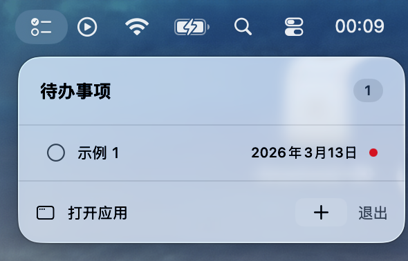

<p align="right">
  <a href="README.md">English</a> | <a href="README_zh.md">中文</a>
</p>

<p align="center">
  
</p>

<h1 align="center">ToDo List</h1>

<p align="center">
  一款使用 SwiftUI 和 SwiftData 构建的现代化 macOS 待办事项应用。
</p>

---

## 截图

| 主界面 | 菜单栏 |
|:-:|:-:|
|  |  |

## 功能特性

- **三栏布局** — 侧边栏筛选、任务列表、详情编辑器，基于 NavigationSplitView 的简洁设计。
- **优先级与分类** — 设置优先级（无 / 低 / 中 / 高），为每个任务分配多个标签。
- **截止日期** — 内联日历选择器，智能相对日期显示（今天、明天、已逾期等）。
- **Markdown 备注** — 使用 Markdown 编写备注，支持完整的块级渲染（标题、列表、代码块、表格），由 [MarkdownUI](https://github.com/gonzalezreal/swift-markdown-ui) 驱动。
- **文件附件** — 通过拖放或文件选择器添加附件。一键打开文件或在 Finder 中显示。安全作用域书签确保跨启动的持久访问权限。
- **智能筛选** — 按全部 / 今天 / 即将到来 / 已完成筛选。按截止日期、优先级或创建时间排序。支持标题、备注和分类的全文搜索。
- **菜单栏快捷入口** — 无需打开主窗口，直接从 macOS 菜单栏查看和管理待办任务。
- **多语言支持** — 完整支持中文、English 和日本語。
- **键盘快捷键** — `⌘N` 创建新任务等。
- **持久化存储** — SwiftData 提供可靠的本地数据持久化，支持自动轻量级迁移。

## 系统要求

- macOS 26.2+
- Xcode 26.2+

## 快速开始

1. 克隆仓库：
   ```bash
   git clone https://github.com/mfzzf/todo-list.git
   ```
2. 在 Xcode 中打开 `ToDo List.xcodeproj`。
3. 等待 Swift Package Manager 解析依赖。
4. 构建并运行（`⌘R`）。

## 许可证

Apache License 2.0 许可证。详见 [LICENSE](LICENSE)。
